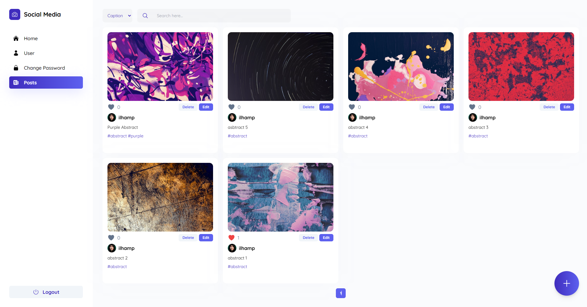
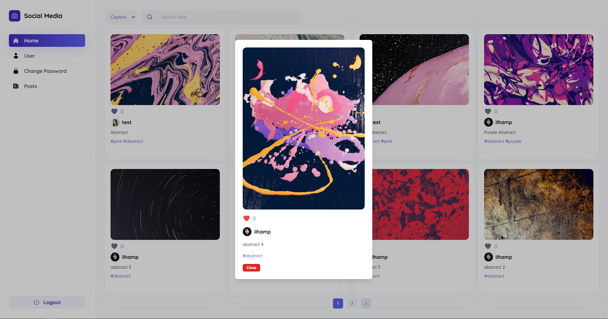
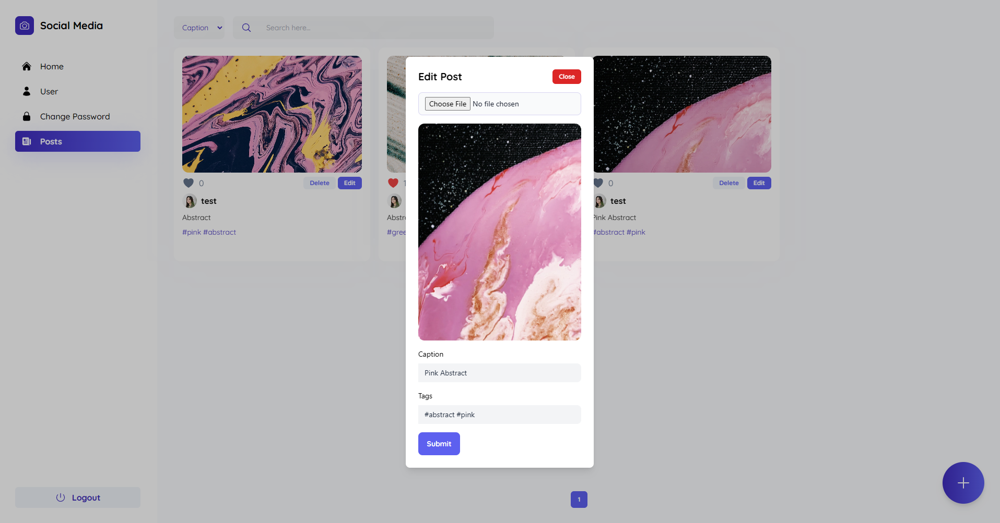
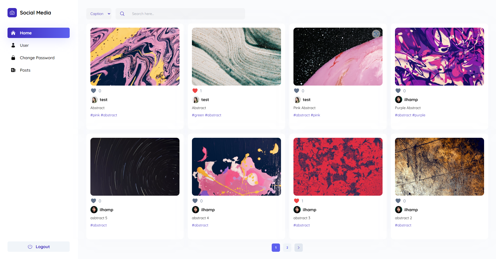

# Social Media Post

Social Media Post Website




### Stack

#### Backend
 - NodeJs
 - ExpressJs
 - PostgreSql
 - Prisma

#### Frontend
 - React
 - Vite
 - Javascript
 - Tailwind

## Getting Started

This is an example of how you may give instructions on setting up your project locally.
To get a local copy up and running follow these simple example steps.

### Prerequisites

This is an example of how to list things you need to use the software and how to install them. (skip if you have installed software)
* npm
  ```sh
  npm install npm@latest -g
  ```

### Instalation Step
Below is an example of how you run project (frontend & backend) in development

1. clone Project
   ```sh
   git clone https://github.com/IlhamPratama1/social-media-post.git
   ```
3. create new database in **postgresql** or import 
4. open **backend** folder (or new terminal in backend folder)
6. crete ```.env``` file in backend folder using format in ```.env.example```
7. npm install in **backend**
   ```sh
   npm install
   ```
6. run ```npm run prisma:migrate```
   ```sh
   npm run prisma:migrate
   ```
7. run ```npm run dev``` to start **backend** app (don't stop the app)
   ```sh
   npm run dev
   ```
8. open **frontend** folder (or new terminal in frontend folder)
9. run ```npm install``` in **frontend**
   ```sh
   npm install
   ```
11. run ```npm run dev``` to start **frontend** app
    ```sh
    npm run dev
    ```
12. Open ```http://127.0.0.1:5173/```
